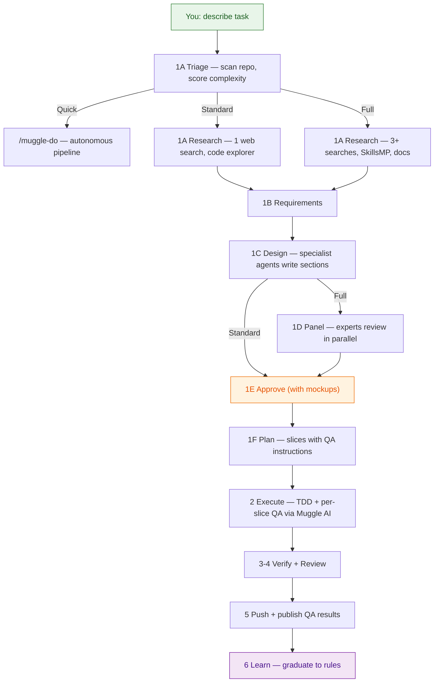

# muggle-ai-teams

**Centralized AI Agent Team Management for Claude Code**

[](LICENSE)
[]()
[]()
[]()

A single, portable folder that organizes your entire Claude Code agent team — agents, skills, commands, rules, workflows, hooks, and contexts — and evolves through usage.

Part of the **Muggle AI** open-source ecosystem:

| Package | Purpose | Install |
|---------|---------|---------|
| **muggle-ai-teams** (this repo) | Agent orchestration, workflow, skills, rules | `npm install @muggleai/teams` |
| **[muggle-ai-works](https://github.com/multiplex-ai/muggle-ai-works)** | QA testing MCP server + autonomous dev pipeline | `npm install @muggleai/works` |

muggle-ai-teams handles *how work gets done* (design → implement → review → deliver). muggle-ai-works handles *QA verification* (test generation, browser replay, cloud results). Together, they form a complete AI-assisted development workflow with built-in quality assurance.

Built by the team behind [MuggleTest](https://www.muggle-ai.com) (AI-powered QA testing platform). Battle-tested building MuggleTest across 6 sub-projects with multi-agent orchestration.

---

## How Is This Different?

There are several excellent projects in the Claude Code ecosystem. Here's how muggle-ai-teams compares:

| | **muggle-ai-teams** | **[Superpowers](https://github.com/obra/superpowers)** | **[Everything Claude Code](https://github.com/affaan-m/everything-claude-code)** | **[Get Shit Done](https://github.com/gsd-build/get-shit-done)** |
|---|---|---|---|---|
| **Focus** | Team management + organization | Development workflow skills | Agent harness optimization | Context engineering |
| **Core idea** | One folder, symlinked everywhere, version-controlled | Composable skills that enforce a systematic dev process | Performance system with instincts, learning, and security | Fresh-context-per-task to prevent quality degradation |
| **Agents** | 29 specialized roles with scope-first routing | Skill-based (no standalone agents) | 28 subagents | Multi-agent orchestration via waves |
| **Skills** | 186 (merged + deduplicated) | ~15 core workflow skills | 116+ | Embedded in prompts |
| **Rules** | 16 domain-split files, loaded on demand | Via skill enforcement | Multi-language rule sets | XML-structured prompts |
| **Learning system** | Behavioral rules graduate to always-loaded files | N/A | Instinct-based with confidence scoring | N/A |
| **Portability** | `setup.sh` symlinks to any machine | Plugin install | Plugin + manual setup | Drop-in folder |
| **Multi-tool** | Claude Code (full), Cursor (partial) | Claude Code | Claude Code, Cursor, Codex, OpenCode | Claude Code, Gemini CLI, Codex, Copilot |

**muggle-ai-teams doesn't replace these projects — it builds on them.** We merged the best parts of Superpowers (workflow discipline) and ECC (agents, skills, hooks) into a unified, deduplicated system, then added:

- **Project-config-driven routing** — each project declares its scopes, agents, and directories; the orchestrator bootstraps new projects automatically
- **Multi-perspective panel review** — 2-round design review with core + domain + gap panelists, SkillsMP-equipped
- **Behavioral learning system** — user corrections graduate to always-loaded rules files, not unreliable memory
- **Domain-based rule loading** — 80% reduction in always-loaded context (562 → 115 lines)
- **Hierarchical workflow** — index + on-demand step files = 100% step compliance with minimal context cost
- **Symlink architecture** — edit once in muggle-ai-teams, available at both global and project level instantly

---

## Quick Start

### Option A: npm install (recommended — auto-updates)

```bash
npm install @muggleai/teams

# Start using it
# In Claude Code, type: /muggle-ai-teams
```

Update to latest: `npm update @muggleai/teams`

### Option B: Git clone (for contributors)

```bash
cd ~/your-project
git clone https://github.com/multiplex-ai/muggle-ai-teams.git
chmod +x muggle-ai-teams/setup.sh
./muggle-ai-teams/setup.sh
```

**What both methods do:**

1. Install `agents/`, `commands/`, `skills/`, `rules/` into `~/.claude/` (global)
2. Back up any existing directories before overwriting
3. npm install copies files (update with `npm update`); git clone symlinks them (edit in place)

No build step required. Works on macOS and Linux.

---

## How to Use It

### Everyday usage (no workflow needed)

After running `setup.sh`, your Claude Code sessions automatically get:

- **29 agents** dispatched based on task type (coding, review, debugging, etc.)
- **52 slash commands** — type `/plan`, `/tdd`, `/code-review`, `/build-fix` anytime
- **186 skills** loaded on demand when relevant
- **16 rules** enforcing code quality, behavioral standards, and routing decisions
- **12 hooks** running automatically (typecheck on edit, formatting, session tracking)

Just use Claude Code normally. The agents, rules, and hooks work in the background.

### Full workflow (`/muggle-ai-teams`)

For larger features, type `/muggle-ai-teams`. You describe what you want. The orchestrator handles the rest.

**The workflow adapts to task complexity:**

| Tier | When | What happens |
|------|------|-------------|
| **Quick** | Small fix, typo, config | Routes to `/muggle-do` — autonomous code → test → QA → PR |
| **Standard** | Normal feature, refactor | Specialist-designed, per-slice QA, skip panel review |
| **Full** | Architecture, security, multi-service | Full panel review, regression sweep, all safeguards |

The orchestrator triages in Step 1A (reads project config + git stat, scores complexity) and recommends a tier. You confirm or override.

The workflow also supports **non-coding missions** (documents, presentations, emails, trip planning). Same design rigor, different execution: specialist agents write content sections instead of code, with user review per section instead of automated QA. No git, no PRs — just quality deliverables.



Each step loads on demand — only ~50 lines in your context at any time, not the full 1500-line workflow.

**Works for non-coding tasks too.** Say "build me an investor pitch deck" and the same workflow runs — specialists design the deck structure, execute section by section, review for quality, and deliver the final output. No code involved.

### Key slash commands

| Command | What it does |
|---------|-------------|
| `/muggle-ai-teams` | Full orchestrated workflow |
| `/plan` | Research + requirements + implementation plan |
| `/tdd` | Test-driven development (RED → GREEN → IMPROVE) |
| `/code-review` | 3-pass review of uncommitted changes |
| `/build-fix` | Fix build/typecheck errors incrementally |
| `/e2e` | Generate and run Playwright E2E tests |
| `/learn-eval` | Extract patterns from session → save to skills or rules |
| `/save-session` | Save session state for resumption later |
| `/docs` | Look up library docs via Context7 |

### Behavioral rules (always active)

These rules enforce how Claude works with you, loaded in every conversation:

- **Diagnose before fixing** — systematic debugging, never guess at root causes
- **Process feedback as checklist** — extract every comment into a numbered table before evaluating
- **Honest pushback** — challenge you when you're wrong, with reasoning
- **Output quality** — readable mockups, sufficient detail, no cramming

### QA automation (via muggle-ai-works)

When [muggle-ai-works](https://github.com/multiplex-ai/muggle-ai-works) is installed, the workflow integrates Muggle AI's QA testing:

- **Per-slice QA** (Step 2) — Each implementation slice is tested against localhost via Muggle AI before committing. The slice's test instructions (written in Step 1F) feed directly to muggle-ai-works as test cases.
- **Regression sweep** (Step 3, full tier) — After all slices, replay all project test scripts to catch cross-slice interaction bugs.
- **Publish results** (Step 5) — QA results are published to Muggle AI cloud and linked in the PR description.

Install muggle-ai-works: `npm install @muggleai/works`

---

## What's Inside

### `/agents` — 29 specialized roles

| Category | Agents |
|----------|--------|
| **Core engineering** | `frontend-engineer`, `backend-engineer`, `general-engineer` |
| **Planning & design** | `planner`, `architect`, `chief-of-staff` |
| **Quality** | `reviewer`, `ux-reviewer`, `security-reviewer`, `tdd-guide`, `e2e-runner` |
| **Build & maintenance** | `build-error-resolver`, `refactor-cleaner`, `doc-updater`, `docs-lookup` |
| **Language-specific** | `cpp-reviewer`, `go-reviewer`, `java-reviewer`, `kotlin-reviewer`, `python-reviewer`, `rust-reviewer` + matching build-resolvers |
| **Operations** | `loop-operator`, `harness-optimizer`, `database-reviewer` |

### `/commands` — 52 slash commands

Development: `/plan`, `/tdd`, `/code-review`, `/build-fix`, `/e2e`, `/verify`, `/quality-gate`

Language-specific: `/cpp-build`, `/go-test`, `/rust-review`, `/kotlin-build`, `/python-review`

Session management: `/save-session`, `/resume-session`, `/sessions`, `/checkpoint`

Skills & learning: `/learn`, `/learn-eval`, `/evolve`, `/skill-create`, `/skill-health`

Operations: `/loop-start`, `/loop-status`, `/devfleet`, `/multi-execute`, `/model-route`

### `/skills` — 186 domain skills

Organized into directories covering: AI/ML patterns, backend frameworks (Django, FastAPI, Express, Spring Boot, Laravel), frontend patterns, SEO/GEO optimization, cloud infrastructure, database migrations, testing strategies, content writing, deployment patterns, and more.

### `/rules` — 16 domain-based rule files

```
Always loaded (every conversation):
  core.md              # Universal principles, honest pushback
  behavior.md          # Debugging discipline, communication, output quality
  agents-routing.md    # Scope-first agent dispatch
  model-selection.md   # Opus/Sonnet/Haiku routing

Loaded on demand:
  coding.md            # TypeScript/React standards (when editing code)
  testing.md           # TDD, coverage gates (when editing tests)
  git.md               # Commit, branch, PR conventions
  quality-gates.md     # Pre-commit checks
  planning.md          # Research-first workflow
  context-management.md # Context window strategy
  agents-advanced.md   # Multi-agent orchestration
  security-php.md      # PHP-specific security rules
  coding-style-php.md  # PHP coding conventions
  patterns-php.md      # PHP design patterns
  hooks-php.md         # PHP hooks
  testing-php.md       # PHP testing
```

### `/workflow` — 12 step files + 3 shared procedures

Step 1A includes built-in triage that routes tasks to 3 tiers (Quick → /muggle-do, Standard → streamlined, Full → complete). Only `reference.md` loads by default (~20 lines). Step files load on demand when the workflow reaches them. Shared procedures (`procedure-skillsmp-search.md`, `procedure-panelist-formats.md`) are loaded by subagents, not the orchestrator — keeping context lean.

### `/hooks` — 12 automated guards

- **PostToolUse**: Auto-format + typecheck after every file edit
- **PreToolUse**: Warn before creating documentation files
- **Stop**: Check for console.log, suggest compaction, track costs, save session
- **SessionStart**: Load session context

### `/contexts` — 3 behavioral modes

- **`dev`** — Write code first, ask questions later
- **`research`** — Read widely before concluding
- **`review`** — Check logic, security, and correctness

---

## Architecture

### Symlink system — edit once, available everywhere

```
muggle-ai-teams/
  agents/         <- single source of truth
  commands/
  skills/
  rules/
  ...

~/.claude/
  agents/ -> muggle-ai-teams/agents/     (global)
  commands/ -> muggle-ai-teams/commands/
  skills/ -> muggle-ai-teams/skills/
  rules/ -> muggle-ai-teams/rules/

your-project/.claude/
  agents/ -> muggle-ai-teams/agents/     (project)
  skills/ -> muggle-ai-teams/skills/
```

### Domain-based rule loading

Instead of one massive rules file that consumes context on every conversation, rules are split by domain. Four core files (~120 lines total) load always. Everything else loads when the task requires it.

### Learning system

When you correct Claude's behavior during a project, the learning system (`/learn-eval`, Step 8) extracts the correction and graduates it to the appropriate rules file — not just memory. This means the correction is enforced in every future session automatically, without requiring Claude to actively recall it.

| Correction type | Graduates to |
|----------------|-------------|
| How to debug/fix | `rules/behavior.md` (always loaded) |
| Communication preferences | `rules/behavior.md` (always loaded) |
| Code quality expectations | `rules/core.md` (always loaded) |
| Testing/CI expectations | `rules/quality-gates.md` |
| Git conventions | `rules/git.md` |
| Technical patterns | Rules files or project `CLAUDE.md` |

### Portability

Clone on a new machine, run `setup.sh`, and your full agent team is operational.

---

## FAQ

### "Which platforms does this work with?"

**Full support: Claude Code.** The orchestrated workflow (parallel agent dispatch, per-slice QA, task tracking, hooks, MCP integration) requires Claude Code's Agent tool, Skill tool, TaskCreate, and hook system.

**Partial support: Cursor.** Reads the markdown agent/skill files and supports MCP (so muggle-ai-works tools work). But cannot spawn subagent specialists in parallel, run hooks, or track workflow tasks. Use the step files as manual guidance rather than automated orchestration.

**Not supported: Codex, Trae, Antigravity, other platforms.** The workflow files are readable markdown, so any AI assistant can follow them as instructions — but the automated orchestration (parallel dispatch, gate enforcement, skill equipping) won't work without the tools above. Contributions to port the orchestration layer are welcome.

| Capability | Claude Code | Cursor | Others |
|-----------|------------|--------|--------|
| Read workflow step files | Yes | Yes | Yes |
| Agent tool (parallel specialists) | Yes | No | No |
| MCP (muggle-ai-works QA) | Yes | Yes | Varies |
| Skills / Commands | Yes | Partial | No |
| Task tracking | Yes | No | No |
| Hooks (auto-format, typecheck) | Yes | No | No |

### "I already have files in `~/.claude/`. Will this blow them away?"

No. `setup.sh` backs up your existing `agents/`, `commands/`, `skills/`, and `rules/` to `.bak` directories before creating symlinks. To undo: remove the symlinks, rename the backups. Your original setup is preserved.

### "186 skills sounds like it'll eat my entire context window."

Skills load on demand — Claude Code reads them only when a matching task triggers them. At rest, zero skill tokens are in your context. During a workflow run, only the current step file (~50 lines) is loaded.

### "I already use Superpowers / Everything Claude Code. Do I install both?"

No. muggle-ai-teams already includes merged, deduplicated versions of both. Installing them separately creates conflicts. If those projects release new skills you want, drop the files into the muggle-ai-teams directories — they'll be picked up automatically.

### "Can I add my own agents and skills?"

Yes. Add files directly to `muggle-ai-teams/agents/` or `muggle-ai-teams/skills/`. Since they're symlinked to `~/.claude/`, Claude Code picks them up immediately. Your additions are version-controlled alongside everything else.

### "Does the full workflow run every time, even for a small bug fix?"

No. The workflow now has 3 tiers. Quick tasks (typos, small fixes) auto-route to `/muggle-do` for autonomous execution. Standard features skip panel review and get lighter research. Only architectural or security-sensitive changes run the full workflow with panel review. The triage happens automatically in Step 1A — you confirm the tier before proceeding.

### "What if I'm mid-project on the old workflow and want to switch?"

Run `scripts/migrate-to-new-workflow.sh`. It detects your existing plans, maps them to the new step numbers, and moves them to the new project-scoped paths. You resume where you left off.

---

## Credits & Acknowledgments

muggle-ai-teams stands on the shoulders of excellent open-source work:

### Core foundations

- **[everything-claude-code](https://github.com/affaan-m/everything-claude-code)** by [@affaan-m](https://github.com/affaan-m) — Source of many agents, commands, skills, and hooks that form the foundation of this collection. Anthropic hackathon winner with 28 subagents, 116+ skills, and the continuous learning system. A massive contribution to the Claude Code ecosystem.

- **[superpowers](https://github.com/obra/superpowers)** by [Jesse Vincent](https://github.com/obra) / [Prime Radiant](https://primeradiant.com) — Workflow skills including brainstorming, writing-plans, executing-plans, TDD, verification, systematic debugging, code review, and parallel dispatch patterns. The discipline backbone of our workflow.

- **[Get Shit Done](https://github.com/gsd-build/get-shit-done)** by TACHES — Context engineering and multi-agent orchestration patterns. Inspired our fresh-context-per-step approach and research-driven planning.

### Skills & integrations

- **[claude-seo](https://github.com/AgriciDaniel/claude-seo)** by [@AgriciDaniel](https://github.com/AgriciDaniel) — 12 SEO audit, planning, and optimization skills.

- **[geo-seo-claude](https://github.com/zubair-trabzada/geo-seo-claude)** by [@zubair-trabzada](https://github.com/zubair-trabzada) — 14 Generative Engine Optimization skills for AI-age search visibility.

- **[ui-ux-pro-max](https://github.com/nextlevelbuilder/ui-ux-pro-max-skill)** by [@nextlevelbuilder](https://github.com/nextlevelbuilder) — UI/UX design intelligence with 50+ styles, 161 color palettes, 57 font pairings, and 99 UX guidelines.

- **[SkillsMP](https://skillsmp.com/)** — Skills marketplace for discovering and sharing Claude Code skills. Used in our research workflow (Step 1A) for finding community skills relevant to each feature.

### Platform & tools

- **[Claude Code](https://claude.ai/code)** by [Anthropic](https://www.anthropic.com) — The platform that makes all of this possible.

- **[Context7](https://context7.com)** — Live documentation lookup integration used by our `docs-lookup` agent and `/docs` command.

---

## About

Built by the team behind **[MuggleTest](https://www.muggle-ai.com)** — an AI-powered QA testing platform that makes software testing accessible to everyone, no coding required.

**Muggle AI open-source ecosystem:**
- **[muggle-ai-teams](https://github.com/multiplex-ai/muggle-ai-teams)** — Agent orchestration, workflow, skills, and rules (this repo)
- **[muggle-ai-works](https://github.com/multiplex-ai/muggle-ai-works)** — Unified MCP server for QA testing + autonomous dev pipeline (`/muggle-do`)

Both repos were created and refined while building MuggleTest — a multi-service platform spanning 6 sub-projects with frontend, backend, MCP servers, Electron apps, and documentation.

---

## License

[MIT](LICENSE) — Use it, fork it, make it yours.

---

If this helps your Claude Code workflow, consider giving it a star. It helps others find it.
